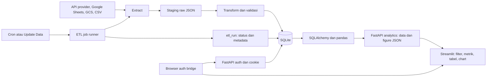

# Peta Proyek Traders Family

Catatan penelusuran kode dan verifikasi lokal pada 7 September 2026. Dokumen ini menjelaskan implementasi checkout saat ini; README digunakan sebagai konteks dan dibandingkan dengan kode. Inventaris statis mencakup 187 file Python, 37.098 baris, termasuk test lokal. Penelusuran berfokus pada hubungan antarmodul, alur data, aturan bisnis, dan operasi. Ini bukan klaim bahwa seluruh skenario browser atau integrasi provider telah diuji.

Pembaruan setelah penelusuran: ketidaksesuaian RBAC Campaign di bagian temuan telah diperbaiki. Endpoint User Acquisition, Brand Awareness, dan Remarketing sekarang mengizinkan `ANALYTICS_ROLES` ditambah finance. Test `tests/test_campaign_access.py` memverifikasi 29 kasus HTTP: akses role yang diizinkan, penolakan role lain/anonim, dan pembatasan Revenue untuk digital_marketing. Semua lulus secara lokal dan di container backend yang dibangun ulang. File test ini diberi pengecualian Git ignore. Bagian temuan berikut tetap merupakan snapshot sebelum perbaikan.

## 1. Tujuan dan arsitektur

Aplikasi merupakan dashboard internal untuk menghubungkan biaya dan performa pemasaran dengan registrasi, aktivitas pengguna, install aplikasi, dan deposit. Fitur tambahan mencakup performa media sosial organik, pengelolaan akun, koneksi token provider, dan operasi database.

FastAPI, Streamlit, dan scheduler adalah proses berbeda. Mereka berbagi file SQLite pada host yang sama. Tidak ada worker queue terpisah seperti Celery pada jalur ETL manual: API memakai `asyncio.create_task` dalam proses backend. Dashboard membaca hasil sinkronisasi, sehingga kesegaran angka bergantung pada ETL dan cache.

## 2. Titik masuk dan tanggung jawab folder

| Lokasi | Peran |
| --- | --- |
| `main.py` | Membuat `FastApiApp` dan mengekspos aplikasi ASGI. |
| `app/utils/app_utils.py` | Lifespan, middleware, router, healthcheck, halaman legal, Uvicorn. |
| `streamlit_run.py` | Bootstrap session, navigasi, dan dispatch handler halaman async. |
| `app/api/v1/endpoint/` | Parameter HTTP, dependency autentikasi/RBAC, validasi rentang, response/error. URL aktual mayoritas `/api/...`, tanpa prefix `/api/v1`. |
| `app/api/v1/functions/` | Perakitan payload analytics; beberapa modul juga memiliki SQL, pandas, dan konstruksi Plotly. |
| `app/services/auth_orchestrator.py` | Orkestrasi login, refresh, logout, cookie, dan commit transaksi auth. |
| `app/utils/campaign/` | Repository, cache adapter, alokasi register/login, agregasi, serializer, chart campaign. |
| `app/utils/overview/` | Active users, campaign cost, acquisition, brand awareness, remarketing. |
| `app/utils/deposit_utils.py` | Agregasi first deposit menurut periode, status, campaign, dan metode deposit. |
| `app/utils/remarketing_deposit_utils.py` | Agregasi deposit terkait last activity. |
| `app/etl/` | Integrasi provider, normalisasi, quality check, staging, load, lifecycle job. |
| `app/db/` | Async engine/session, model, init, dan migration-lite. |
| `streamlit_app/app_shell/` | Konfigurasi halaman/role, navigasi, routing URL, restore session. |
| `streamlit_app/functions/` | API client, auth runtime, UI, chart, tanggal, account dialog. |
| `streamlit_app/page/` | Halaman produk dan komponen pendukungnya. |
| `scripts/`, `docker/` | Scheduler wrapper, cron, backup, maintenance, logrotate. |

Dependency utama dipin di `requirements.txt`: Python 3.12 pada Docker, FastAPI 0.128.1, Streamlit 1.54.0, SQLAlchemy 2.0.46, pandas 2.3.3, Plotly 6.5.2, httpx, SDK Google, python-jose, bcrypt/passlib, cryptography. Ini versi deklarasi repo, bukan penilaian kompatibilitas terbaru provider.

## 3. Alur autentikasi end-to-end

1. Streamlit menginisialisasi session state. Jika belum login dan restore belum selesai, custom component browser menjalankan request restore.
2. Login browser menuju backend publik. Kredensial diperiksa di `authenticate_user`, email dinormalisasi, password diverifikasi dengan bcrypt, throttle dan audit dicatat.
3. Backend menghasilkan access JWT, refresh JWT, dan opaque session handle. SHA-256 fingerprint token/handle dipersist di `user_token`.
4. Access token dikembalikan ke state Streamlit. Bila remember-me aktif, browser mendapat cookie `tf_session` dengan `HttpOnly`; bila tidak, cookie persisten dibersihkan.
5. Request analytics server-side memakai bearer access token. Verifikasi mencakup signature/expiry JWT, kecocokan fingerprint pada DB, serta status session. User yang sudah soft-delete tidak menjadi current user.
6. Saat API mengembalikan 401, helper meminta browser melakukan refresh agar cookie HttpOnly ikut terkirim. Setelah hasil component tersedia, state diperbarui dan request dicoba lagi.
7. Refresh mengganti token dan expiry session, tetapi implementasi mempertahankan session handle yang sama. Nama `rotate_session_handle` tidak berarti nilai cookie selalu berganti.
8. Logout merevoke session aktif; logout-all merevoke seluruh session target yang diizinkan.

Password minimal 12 karakter dengan huruf besar/kecil, angka, karakter khusus, dan variasi karakter. Lima kegagalan login memicu lockout 15 menit. Ada rate limit auth berbasis SQLite. Secret eksternal pada `managed_secret` dienkripsi Fernet; kuncinya diturunkan dari `APP_ENCRYPTION_KEY`, dengan fallback JWT secret.

URL backend ada dua konteks: `STREAMLIT_API_HOST` untuk panggilan antarkontainer dan `BACKEND_PUBLIC_URL` untuk browser. Konfigurasi yang benar pada satu jalur belum membuktikan jalur lain berfungsi.

OAuth Google Ads/YouTube/TikTok dimulai oleh superadmin melalui endpoint terautentikasi, lalu pengguna diarahkan ke consent provider. Callback memvalidasi state dan aktor sebelum code exchange; YouTube juga memeriksa channel, sementara TikTok menggunakan PKCE. Token disimpan terenkripsi untuk extractor. Meta menggunakan pertukaran short-lived token menjadi long-lived token; Instagram menyediakan status/exchange/save/refresh. Halaman callback yang dapat dibuka tanpa session dashboard tidak sama dengan izin menyimpan token secara anonim.

Role frontend: superadmin mendapat seluruh halaman; analyst dan tech_it mendapat halaman analytics tanpa Settings; finance mendapat Overview, Campaign, dan Revenue; digital_marketing mendapat Overview, Campaign, Socmed, dan Activity; social_media mendapat Home dan Socmed; sales belum memiliki halaman aktif. `admin` merupakan alias legacy analyst pada helper RBAC umum, tetapi guard Install memakai daftar role exact sendiri. Policy role tersebar pada konfigurasi navigasi dan dependency endpoint.

## 4. Halaman dan data yang dikonsumsi

| Grup | Halaman/alur | Data utama |
| --- | --- | --- |
| Portal | Home | Konteks user/account dan ringkasan ETL terbaru. |
| Overall | Overview | Lima kelompok analytics overview, GA4 app/web/gabungan, install untuk role yang berhak. |
| Campaign | User Acquisition | Biaya, impressions, clicks, register; breakdown campaign/ad group/ad; rasio dan growth. |
| Campaign | Brand Awareness | Spend, impressions, clicks, CTR, CPM, CPC. |
| Campaign | Remarketing | Performa iklan dan aktivitas login; builder sumber dibatasi Google/Facebook. |
| Revenue | First Deposit | `data_depo`, dimensi campaign, status pengguna, metode deposit. |
| Revenue | Remarketing Deposit | `data_ms_deposit`, last activity dan last deposit. |
| Activity | Register | Registrasi per campaign/tag dari `daily_register`, plus All Regis per source dari `regis_utm_daily`. |
| Activity | Login | Email unik dari `data_ms_deposit` berdasarkan `last_activity`, bukan audit login dashboard. |
| Activity | Install | Play Console dan App Store Connect; historical backfill didukung. |
| Socmed | Instagram/Facebook/TikTok/YouTube | Metrik akun harian atau snapshot dan metrik konten/media. |
| Settings | Create Account | Buat/edit/soft-delete/restore akun sesuai otorisasi backend. |
| Settings | Update Data | Submit satu source, tampilkan run ID, polling status dan summary. |
| Settings | Database Maintenance | Statistik file/page SQLite dan VACUUM. |
| Settings | Token provider | Google Ads, Meta, Instagram, TikTok, YouTube; OAuth callback/token exchange. |

Mayoritas response analytics berbentuk `success`, `message`, `data`. Banyak payload memuat `rows` dan `figure` Plotly yang dibangun backend. UI melakukan presentasi, filter, dan penyimpanan payload di session state; beberapa halaman sosial membangun visual dari rows. Perubahan field payload perlu ditelusuri sampai komponen UI, bukan hanya endpoint.

## 5. Model data dan aturan bisnis

`campaign` adalah dimensi penghubung ads, register, dan deposit. Penentuan source memakai awalan nama `GG`, `FB`, `TT`; tipe memakai pola `- UA -`, `- BA -`, `- RM -`. Nama yang tidak mengikuti pola menjadi `unknown`. Klasifikasi ini memengaruhi filter laporan.

Tabel fact utama: `google_ads`, `facebook_ads`, `tiktok_ads`, `ga4_daily_metrics`, `daily_register`, `regis_utm_daily`, `data_depo`, `data_depo_ba`, `data_ms_deposit`, `play_console_install_metrics`, `apple_install`, serta tabel insights harian dan media tiap platform sosial. Tabel operasional meliputi `tf_user`, `user_token`, `login_throttle`, `auth_rate_limit_event`, `auth_audit_event`, `log_data`, `etl_run`, `schema_migration`, `managed_secret`, dan `stg_ads_raw`.

Aturan yang penting saat membandingkan angka:

- Grain ads adalah tanggal + campaign ID + ad group + ad name. Deduplikasi ETL mempertahankan row terakhir, tidak menjumlahkan duplicate.
- Register campaign analytics berasal dari `daily_register`. Untuk beberapa row iklan pada campaign/tanggal yang sama, total register dibagikan proporsional biaya; ketika total biaya nol, dibagi merata. Angka level ad adalah hasil alokasi, bukan atribusi individu yang diamati.
- Overview total register menjumlahkan semua `daily_register` dalam periode. Breakdown by-source menghubungkan register dengan campaign ads yang cocok. Kedua cakupan tersebut bisa berbeda.
- Cost per register = cost/register; CTR = clicks/impressions × 100; CPC = cost/clicks; CPM = cost/impressions × 1.000. Denominator nol umumnya menghasilkan nol.
- Pembanding growth overview/campaign umumnya periode sebelumnya dengan panjang hari yang sama. Bila baseline nol, current positif menghasilkan 100%, bukan infinity/undefined.
- First deposit disaring dan dikelompokkan menurut `tanggal_regis`. Ini laporan cohort registrasi, sehingga tidak otomatis sama dengan cash-in pada tanggal transaksi.
- Remarketing revenue mensyaratkan `last_activity` dan `last_depo` berada dalam periode, lalu mengelompokkan menurut last activity.
- Konversi deposit ke IDR pada overview memakai `USD_TO_IDR_RATE`, default 16.000. Ini konfigurasi aplikasi, bukan kurs real-time. Field `cost_to_first_deposit` menghitung deposit IDR/cost × 100.
- GA4 mengambil `active1DayUsers`, `active28DayUsers`, `activeUsers`. Label database `monthly_active_users` mewakili 28 hari. Stickiness = DAU/28-day active users × 100. App+web adalah penjumlahan, bukan deduplikasi user lintas platform; card active user menggunakan rata-rata harian.
- TikTok account analytics memakai snapshot terakhir untuk counter kumulatif. Counter snapshot tidak boleh diperlakukan sebagai jumlah aktivitas harian. Konten sosial tertentu memakai lifetime metrics; rentang tanggal konten tidak selalu sama dengan rentang terjadinya engagement.
- Apple membedakan first-time downloads, redownloads, deletions, dan active devices. Transform memilih processing partition terbaru dan mengecualikan update dari download. Test lama masih mengharapkan `installations` yang tidak lagi dikeluarkan row builder.

## 6. ETL dan integrasi

Ada 20 source default terjadwal, sesuai urutan `DEFAULT_SCHEDULED_SOURCES`:

1. `google_ads`
2. `facebook_ads`
3. `tiktok_ads`
4. `unique_campaign`
5. `ga4_daily_metrics`
6. `instagram_insights`
7. `instagram_media_insights`
8. `tiktok_insights`
9. `tiktok_media_insights`
10. `youtube_daily_insight`
11. `youtube_media_insight`
12. `facebook_page_insights`
13. `facebook_page_media_insights`
14. `daily_register`
15. `regis_utm_daily`
16. `first_deposit`
17. `first_deposit_ba`
18. `ms_deposit`
19. `play_console_install_metrics`
20. `apple_install`

Executor tambahan: `apple_install_snapshot` dan `apple_report_request`.

| Sumber | Jalur extract |
| --- | --- |
| Google Ads | Google Ads API; ad-level standard campaign dan campaign-level Performance Max. Cost micros dibagi 1.000.000. |
| Facebook Ads | Meta Insights dengan pagination; ad-level per hari. |
| TikTok Ads | Google Sheets, berbeda dari integrasi TikTok organik. |
| GA4 | Analytics Data API, per tanggal/platform. |
| Register/deposit | Google Sheets dengan range masing-masing. |
| Instagram/Facebook organik | Graph API account/page dan media/post insights; sebagian optional metric boleh tidak tersedia. |
| TikTok organik | User info dan video list, snapshot/counter, refresh token jika diperlukan. |
| YouTube | OAuth, Analytics API dan metadata/video list; parallelism dibatasi untuk media. |
| Play Console | CSV export dari GCS; memilih file install overview menurut bulan/package. |
| Apple | App Store Connect report request → report instance → segment TSV gzip; mengolah tanggal data dan processing date. |

Lifecycle manual: request divalidasi → pengecekan active run → record `queued` → background task → `running` → extract → stage dan commit → transform/filter/dedupe/quality check → delete+load reporting window dalam transaksi → `success` atau `failed` → status di UI. Scheduler memakai runner yang sama, tetapi menunggu setiap source selesai secara serial.

Default auto window adalah H-7 sampai H-1 untuk mengakomodasi koreksi sumber. TikTok account snapshot memakai hari ini; Apple auto memakai H-5. Manual memakai rentang eksplisit. Apple snapshot hanya diterima mode manual pada endpoint.

Staging menyimpan JSON, hash payload, source, range, run ID, dan ingestion time. Retensi default 7 hari. Load menggunakan SQLite upsert dan chunk untuk membatasi bind variables. Staging dan final-load bukan satu transaksi: raw staging tetap berguna untuk investigasi setelah validasi/load gagal.

Perilaku penting: shared runner mengosongkan window target jika hasil extract/parse kosong atau tidak ada row dalam window. Ini rekonsiliasi yang disengaja oleh kode, tetapi hasil kosong akibat parsing/source perlu dibedakan dari nol data yang valid.

Observability menyimpan status, waktu, window, row count, quality report, dan error. `rows_loaded` dihitung dari jumlah row tabel pada window setelah job; bukan penghitung insert murni. Runner tidak mengisi `rows_extracted` pada jalur sukses yang ditelusuri. Quality report menyatakan tidak ada exception quality, bukan laporan lengkap hasil tiap rule.

## 7. Database, cache, deployment

SQLite file-backed memakai foreign keys, busy timeout, WAL, synchronous NORMAL, dan NullPool. SQLite in-memory memakai StaticPool. Constraint `WORKERS=1` diperiksa runtime. Schema dibuat eksplisit dengan `init_db.py`; `migrate_db.py` menerapkan daftar migration idempotent yang dicatat di `schema_migration`.

Urutan Docker: `db-init` selesai → backend menjalankan migrasi lalu server → frontend dan scheduler menunggu backend healthy. Volume mencakup database, logs, run locks, dan backup. Cron ETL pukul 08:00 Asia/Jakarta. Wrapper memilih Python lokal/container dan memakai `flock` jika tersedia, atau lock file fallback. CLI melanjutkan source berikutnya ketika satu source gagal, kecuali `--fail-fast`.

Backend memiliki cache DataFrame dalam proses dengan default TTL 300 detik dan maksimum 64 entry, defensive copy, serta lock. Pembersihan cache setelah ETL hanya berlaku di proses pemanggil. Karena scheduler terpisah dari backend, hasil ETL scheduler bisa menunggu TTL backend; payload yang disimpan Streamlit memiliki lifecycle refresh tersendiri.

Backup memakai SQLite backup API. Maintenance memeriksa status, active ETL, page/freelist, dan mendukung VACUUM; CLI maintenance juga menyediakan integrity check dan backup. Request logging menggunakan antrean terbatas dan batch flush agar tidak menulis setiap request secara sinkron. Queue penuh dapat menyebabkan log dibuang. Healthcheck `SELECT 1` tidak membuktikan kesegaran data atau keberhasilan provider.

## 8. Temuan yang terverifikasi dan batasannya

| Temuan | Bukti dan dampak |
| --- | --- |
| RBAC Campaign tidak konsisten | Navigasi mengizinkan `digital_marketing`, tetapi endpoint UA/BA/Remarketing memakai `FINANCE_ANALYTICS_ROLES` yang tidak memuat role itu. Dependency akan menolak dengan 403. Belum diuji melalui browser user sebenarnya. |
| Test suite gagal collection | `test_rbac_navigation.py` dan `test_security_helpers.py` mengimpor `ALLOWED_ROLES` dari `user_utils`; definisi sekarang di `rbac.py`. |
| Test lain belum hijau | Setelah dua file tersebut dikecualikan: 50 passed, 15 failed. Kegagalan mencakup field `tag_name`, kontrak Apple/social, mock staging/helper, bentuk error API, serta aturan admin lama. Tidak semua failure membuktikan bug runtime; sebagian ekspektasi test tertinggal. |
| Sebagian besar test lokal di-ignore | `.gitignore` mengabaikan `/tests/`. `git ls-files tests` hanya menampilkan `test_youtube_media_transform.py`. Test yang tersedia lokal belum otomatis tersedia pada fresh clone. |
| README tertinggal | Daftar role, source scheduler, public/token pages, dan contoh baseline test berbeda dari implementasi. `.env` tidak tracked pada checkout ini; riwayat kebocoran secret tidak diperiksa. |
| Durasi session awal tidak sepenuhnya configurable | `session_utils.user_token` menetapkan expiry awal 7 hari, sedangkan refresh/cookie mengikuti `REFRESH_TOKEN_EXPIRE_DAYS`. Dampak muncul jika konfigurasi bukan 7. |
| Job background tidak durable | Restart proses dapat menghentikan task. Record queued/running yang lebih dari 6 jam dipulihkan menjadi failed ketika trigger berikutnya melakukan cleanup. |
| Pencegahan overlap punya batas | Pengecekan active run dan insert merupakan langkah aplikasi terpisah, bukan dedicated distributed lock. Lock cron melindungi scheduler wrapper; bukan bukti bahwa semua jalur manual/scheduler atomik satu sama lain. |
| Kosong dapat menghapus window | Shared runner memperlakukan DataFrame kosong sebagai replacement kosong sebelum validasi non-empty. Validitas respons kosong penting untuk keutuhan data. |

Snapshot database lokal, dibaca read-only tanpa mengambil data personal/token:

- `campaign_data.db`: 31 tabel; ukuran file sekitar 443 MiB. Riwayat ETL berisi 493 success dan 407 failed. Pada 20 record terbaru yang terlihat, 19 failed dan 1 success (`unique_campaign`), bertanggal 6 September 2026. Penyebab kegagalan belum didiagnosis; ini bukan bukti keadaan deployment lain.
- `campaign_data_dev.db`: 16 tabel, sekitar 45,7 MiB, tanpa tabel `schema_migration`. Data run terakhir yang terlihat berasal dari Maret 2026. File ini belum sesuai prasyarat bootstrap terbaru.
- Riwayat migrasi database utama memuat `20260730_001_play_console_total_installs`, sementara daftar migration pada kode checkout saat ini tidak memuat ID tersebut. Ada perbedaan sejarah schema yang perlu diperhatikan ketika membandingkan database existing dengan fresh init.

Verifikasi yang dijalankan: parsing sintaks seluruh inventaris Python, pembacaan model/route/call flow, dua invocation pytest, dan query metadata/summary SQLite read-only. Tidak menjalankan ETL nyata, OAuth baru, perubahan akun, migrasi database existing, maupun deployment. Kode aplikasi tidak diubah dalam penelusuran ini.

## 9. Peta dampak untuk pekerjaan berikutnya

- Mengubah KPI: mulai dari query/model → agregasi di utils atau fetch module → kontrak response → komponen Streamlit → kasus test denominator nol, duplicate, dan batas tanggal.
- Menambah source: extractor → transform → quality → staging/load/model → migration → pipeline spec → job registry/date mapping → form Update Data → scheduler bila diperlukan → test isolated database.
- Mengubah role: sinkronkan `rbac.py`, dependency endpoint, `ROLE_PAGE_ACCESS`, dan guard khusus Install/token; akses menu saja tidak cukup.
- Menangani data tidak update: periksa `etl_run` per source/window → error dan raw staging → tabel fact → classification campaign → cache backend → payload session Streamlit.
- Menangani login: periksa URL publik/internal → browser component → cookie → auth response → session fingerprint/expiry → role user aktif.
- Menyiapkan fresh deployment: pastikan konfigurasi environment dan kredensial tersedia → init/migration → bootstrap akun jika diaktifkan → health API/frontend → koneksi provider → ETL terkontrol → rekonsiliasi hasil dashboard.

Prioritas tindak lanjut yang didukung temuan: selaraskan akses Campaign, diagnosis kegagalan ETL terbaru, benahi versioning/kontrak test, lalu selaraskan dokumentasi dan fresh-database behavior. Perbaikan tersebut belum dilakukan karena tugas ini berfokus pada mempelajari proyek.
